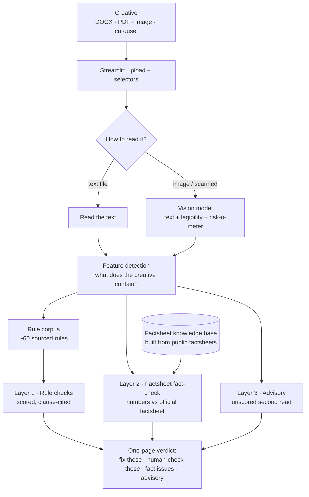

# SEBI Ad-Code Compliance Checker

**A first-pass compliance check for mutual-fund marketing creatives.** Upload a banner, brochure, or social post and get back a plain-English verdict — what breaks the SEBI advertising rules, what a human still needs to confirm, and which numbers don't match the official fund factsheet — each with the exact change to make.

It's built for the people who *make* the creatives (marketing, product, design) to self-check their work **before** it goes to the compliance team.

> ⚠️ It flags issues to resolve — it is **not** a compliance sign-off. A human compliance reviewer still gives the final approval.

*A note on data: this is a public portfolio project. Every rule comes from public SEBI/AMFI documents, all company-identifying details are genericized as `[AMC]` / `[Sponsor Bank]`, and the one internal artifact (the firm's checklist) is never committed. See [Responsible data handling](#responsible-data-handling).*

---

## The problem

At an asset-management company, every marketing creative — press ads, distributor brochures, WhatsApp forwards, Instagram posts — must be screened against the **SEBI advertisement code** before it can be published. Today a small compliance team does this by hand, one creative at a time, over email. That means:

- **Slow, unpredictable turnaround** — reviews queue up and bottleneck on a few people.
- **Late surprises** — avoidable issues (a missing disclaimer, a "guaranteed returns" claim) surface close to launch and force last-minute rework.
- **Skilled people doing routine work** — experts spend time catching the same obvious mistakes instead of the genuinely hard judgment calls.

This tool moves the obvious catches **upstream to the creator**, so the compliance team receives cleaner material and spends its time where it actually adds value.

## What it does

You **upload a creative**, tell it the **business area** (e.g. a mutual-fund scheme) and the **type** (banner, social post, etc.), and it returns a structured verdict in three clearly separated parts:

1. **Rule checks** — does it break the SEBI ad code, AMFI guidelines, or the firm's internal checklist? Each issue comes with a plain-English reason and the exact edit to make.
2. **Factsheet fact-check** — do the numbers in the creative (returns, AUM) actually match the fund's **official published factsheet**? A wrong return figure is a factual error, reported on its own.
3. **Advisory** — a softer second read that flags anything that could *mislead an investor* even when no specific rule is broken.

It reads Word docs, PDFs, and — importantly — **images and banners**, because a large share of real violations are visual: a mandatory warning that's present but printed too small to read, a missing risk-o-meter, a low-contrast disclaimer.

## Why it's built the way it is (the interesting part)

**1 · Three separate layers, never merged.** A rule violation, a wrong number, and a "this feels misleading" observation are three different things with three different levels of certainty. Blending them into one score would look simpler but would destroy the tool's credibility. So they stay separate: one **scored, rule-cited** layer the compliance team can trust; one **factual** layer checked against dated official data; one **advisory** layer that never affects the score.

**2 · The intelligence lives in a rule "corpus", not the AI.** The heart of the tool is a hand-built library of ~60 rules, each translated from the real SEBI/AMFI regulations and the firm's checklist, and each carrying its source clause, a severity, and a worked pass/fail example. The AI *applies* these rules and reads the creatives — but *what counts as a violation* is defined by the corpus, which is auditable and updatable when regulations change. (SEBI replaced a master circular mid-project; because every rule is dated and sourced, that's a targeted update, not a rebuild.)

**3 · It reads images like a reviewer, not like OCR.** Plain text extraction (OCR) turns a 4-point illegible disclaimer and a perfectly clear one into the *same* string — so the violation vanishes. Instead the tool uses a **vision model** that answers both "what does this say?" *and* "is the mandatory warning present and legibly sized?" — catching the visual violations that matter most.

**4 · It never hides a bad read.** Every result shows the tool's **extraction confidence** and a **"what the tool read"** panel, so a garbled scan is caught at a glance instead of being confidently checked as if it were correct.

**5 · It flags for a human instead of guessing.** Some things a model genuinely can't decide from the file alone (is that person a celebrity? does this match the approved script?). Those are marked **"needs a human check"** and routed onward — the tool never pretends to make a call it can't.

## How it works



In plain terms: the creative is read (as text, or by vision for images), the tool detects what it contains, that decides which rules apply, and the result is assembled into three separate sections — plus a fact-check against a knowledge base built from the public factsheets.

## A quick example

**Input** — a banner that reads:
> *"Invest in [AMC] Flexi Cap Fund and get GUARANTEED 12% annual returns — capital fully protected! Our unbeatable #1 fund. CAGR 1Y: 18% | 3Y: 22% | 5Y: 20%."*

**What the tool returns:**

| Layer | Finding |
|---|---|
| 🔴 Rule check | **No guaranteed / protected returns** — "guaranteed 12%… capital fully protected" promises something a market-linked fund can't. *Change: remove the guarantee / protection wording.* |
| 🔴 Rule check | **No rankings** — "#1 / unbeatable" is an unsupported ranking claim. *Change: remove it, or cite a proper dated source.* |
| 🔴 Rule check | **Missing risk warning** — the mandatory "Mutual Fund investments are subject to market risks…" line isn't present. *Change: add it verbatim.* |
| 🔴 Fact-check | Creative says **12% guaranteed**; the official factsheet (as of 30 Jun 2026) shows **0.85%** for that scheme. |
| 🟠 Advisory | The guaranteed-12% figure sits right next to 18–22% CAGRs, inviting the reader to treat 12% as a floor — doubly misleading. |

## Tech stack

- **Python 3.12**
- **Streamlit** — the single-page web app (upload, select, read the verdict)
- **Anthropic Claude** (official SDK) — tiered on cost: a fast model (**Haiku**) for reading and classification, a stronger model (**Sonnet**) for rule judgment, the advisory read, and vision
- **pdfplumber · PyMuPDF · python-docx** — reading Word docs and both text-based and scanned PDFs
- **RapidFuzz** — fuzzy-matching the mandatory disclaimer texts (tolerant of line-break / punctuation drift, and Devanagari-aware for Hindi)
- **JSON Schema** — the rule, verdict, and factsheet-record shapes are schema-defined and validated (the schemas are the source of truth)
- A **one-command evaluation script** — every rule ships a pass and a fail example, so the corpus doubles as the test set

## How it's tested

Evaluation is built in, not bolted on. Because every rule carries a worked pass and fail example, the corpus *is* the test set. A one-command script runs the real engine against all of them: the deterministic checks currently score **100%**, and an image test confirms the vision path catches an illegible-disclaimer banner that plain OCR would wave through. Accuracy is re-checked on every rule or prompt change.

## Scope & honest limitations

- **It advises; it does not approve.** Every output is an issue to resolve or a check to route onward — never a compliance sign-off.
- **Video is parked.** Video rules are written but switched off — video adds a time dimension (a disclaimer flashing for one second, voice-over rules) that deserves its own phase.
- **A first, focused rule set.** ~60 rules covering the highest-value areas (general schemes / NFOs); more business areas are a straightforward extension of the same corpus.
- **No login, database, or workflow routing.** It's a focused prototype: upload, check, read.

## Responsible data handling

This is a **public portfolio project**, so it's built to be shared safely:

- **Only public sources.** Every rule is derived from the real, current public SEBI and AMFI documents (versioned by date), and the factsheet data comes from the publicly downloadable factsheets — never internal versions.
- **The one internal artifact never leaves the machine.** The firm's internal compliance checklist is gitignored and never committed.
- **Company-identifying details are genericized** everywhere in the committed code as `[AMC]` / `[Sponsor Bank]`.
- **Tested only with generic sample copy** written for the purpose — never real campaign material.

## Run it locally

```bash
git clone https://github.com/sachinj9074/SEBI-Ad-Code-Compliance-Checker.git
cd SEBI-Ad-Code-Compliance-Checker

python -m venv .venv
.venv\Scripts\activate        # Windows
# source .venv/bin/activate   # macOS/Linux

pip install -r requirements.txt
```

Add your Anthropic API key to a `.env` file (copy `.env.example`):

```
ANTHROPIC_API_KEY=your-key-here
```

Then launch the app and pick a **bundled sample** from the sidebar to try it with no upload:

```bash
streamlit run app/app.py
```

## Demo

A short screen-recording and a hosted, access-controlled demo are on the roadmap — happy to give a **live walkthrough or private demo access on request**.

## Roadmap

- Hosted, access-controlled live demo
- A short screen-recording walkthrough
- Video creative support (temporal checks: flash-frame disclaimers, voice-over requirements)
- More business areas (AIF, PMS, branding, social) — same corpus, more rules

---

*Curious about the engineering? The full build spec — design decisions, rule schema, evaluation approach, and the three-day build log — lives in [docs/PRODUCT_SPEC.md](docs/PRODUCT_SPEC.md).*
