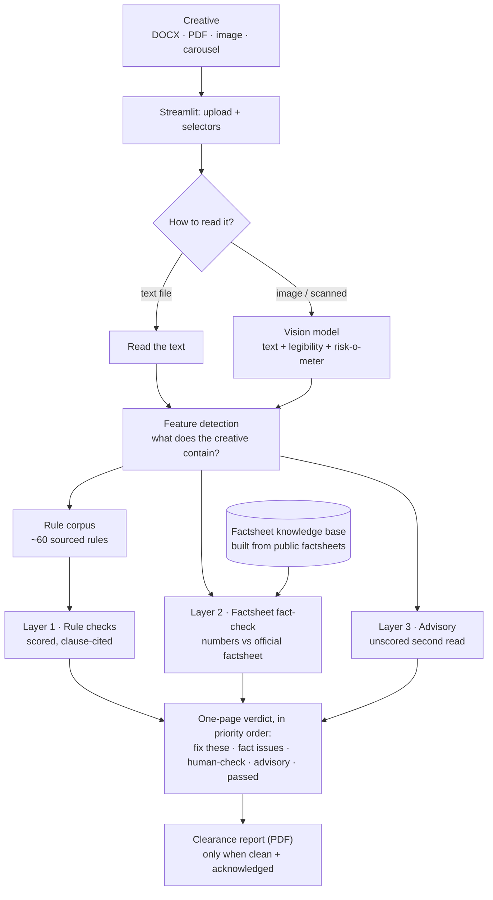
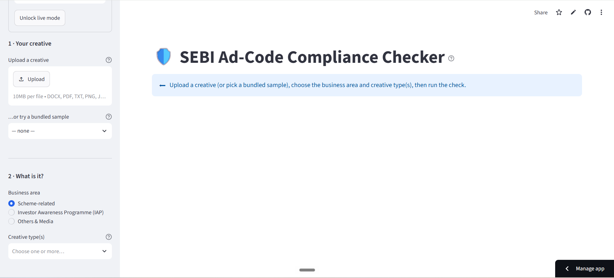
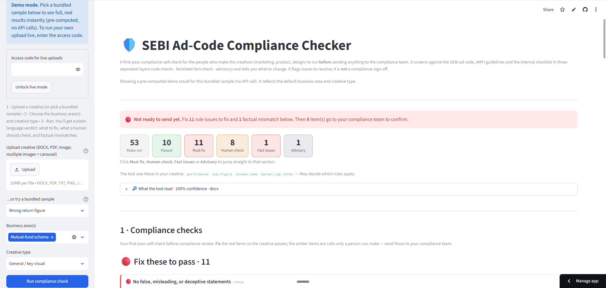
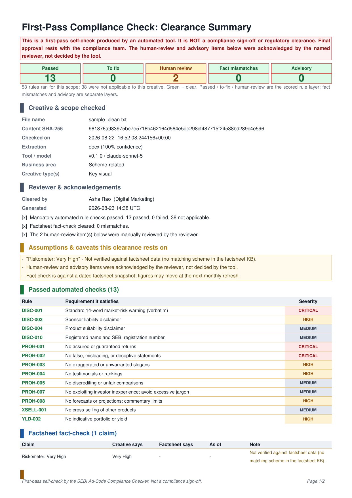

# SEBI Ad-Code Compliance Checker

**A first-pass compliance check for mutual-fund marketing creatives.** Upload a banner, brochure, or social post and get back a plain-English verdict: what breaks the SEBI advertising rules, what a human still needs to confirm, and which numbers don't match the official fund factsheet, each with the exact change to make.

It's built for the people who *make* the creatives (marketing, product, design) to self-check their work **before** it goes to the compliance team.

> ⚠️ It flags issues to resolve; it is **not** a compliance sign-off. A human compliance reviewer still gives the final approval.

---

## The problem

At an asset-management company, every marketing creative (press ads, distributor brochures, WhatsApp forwards, Instagram posts) must be screened against the **SEBI advertisement code** before it can be published. Today a small compliance team does this by hand, one creative at a time, over email. That means:

- **Slow, unpredictable turnaround.** Reviews queue up and bottleneck on a few people.
- **Late surprises.** Avoidable issues (a missing disclaimer, a "guaranteed returns" claim) surface close to launch and force last-minute rework.
- **Skilled people doing routine work.** Experts spend time catching the same obvious mistakes instead of the genuinely hard judgment calls.

This tool moves the obvious catches **upstream to the creator**, so the compliance team receives cleaner material and spends its time where it actually adds value.

## What it improves

The point isn't just catching mistakes; it's moving a business metric. Three levers:

- **Faster approvals.** Obvious issues are caught before the creative ever reaches compliance, so review turnaround time (TAT) drops instead of queueing.
- **Fewer rework cycles.** Creators fix problems at draft stage rather than after a late rejection close to launch.
- **Compliance bandwidth freed.** Experts spend their time on genuine judgment calls, not routine screening.

The exact figures (how far TAT falls, how many rework cycles are saved) are what to measure once it's running against real volume.

## What it does

You **upload a creative** and tell it two things: the **business area** (a mutual-fund scheme, an investor-awareness programme, or other/media) and, where it applies, the **creative type** (an NFO, a key visual, a yield creative, a social post, and so on). Those two choices decide which rules run. It then returns a structured verdict in three clearly separated parts:

1. **Rule checks.** Does it break the SEBI advertisement code or AMFI guidelines? Each issue comes with a plain-English reason and the exact edit to make.
2. **Factsheet fact-check.** Do the numbers in the creative (returns, AUM) actually match the fund's **official published factsheet**? A wrong return figure is a factual error, reported on its own.
3. **Advisory.** A softer second read that flags anything that could *mislead an investor* even when no specific rule is broken.

The verdict is laid out in **priority order**: what to fix first, then the factual issues, then the items a human still needs to confirm, then advisory notes, then everything that already passed. A clickable summary strip at the top jumps you straight to any section.

When a creative comes back **clean** (no rule failures, no factual mismatches) and the reviewer has ticked off the human-check and advisory items, the tool produces a **downloadable clearance report (PDF)** to attach when handing the creative to compliance. It sets out what passed, what was assumed, and what a person still confirmed by hand, and states plainly that it is a first-pass self-check, not a sign-off.

It reads Word docs, PDFs, and (importantly) **images and banners**, because a large share of real violations are visual: a mandatory warning that's present but printed too small to read, a missing risk-o-meter, a low-contrast disclaimer.

## Why it's built the way it is (the interesting part)

**1 · Three separate layers, never merged.** A rule violation, a wrong number, and a "this feels misleading" observation are three different things with three different levels of certainty. Blending them into one score would look simpler but would destroy the tool's credibility. So they stay separate: one **scored, rule-cited** layer the compliance team can trust; one **factual** layer checked against dated official data; one **advisory** layer that never affects the score.

**2 · The intelligence lives in a rule "corpus", not the AI.** The heart of the tool is a hand-built library of ~60 rules, each translated from the current SEBI and AMFI regulations, and each carrying its source clause, a severity, and a worked pass/fail example. The AI *applies* these rules and reads the creatives, but *what counts as a violation* is defined by the corpus, which is auditable and updatable when regulations change. (SEBI replaced a master circular mid-project; because every rule is dated and sourced, that was a targeted update, not a rebuild.)

**3 · It reads images like a reviewer, not like OCR.** Plain text extraction (OCR) turns a 4-point illegible disclaimer and a perfectly clear one into the *same* string, so the violation vanishes. Instead the tool uses a **vision model** that answers both "what does this say?" *and* "is the mandatory warning present and legibly sized?", catching the visual violations that matter most.

**4 · It never hides a bad read.** Every result shows the tool's **extraction confidence** and a **"what the tool read"** panel, so a garbled scan is caught at a glance instead of being confidently checked as if it were correct.

**5 · It flags for a human instead of guessing.** Some things a model genuinely can't decide from the file alone (is that person a celebrity? does this match the approved script?). Those are marked **"needs a human check"** and routed onward. The tool never pretends to make a call it can't.

**6 · It ends in an artifact, not an approval.** A clean creative produces a **clearance report** the creator can attach when they hand it over, but only after they have personally acknowledged the human-check and advisory items, and the report says on its face that it is a first-pass self-check, not a sign-off. It shortens the handover without ever pretending to be the approval itself.

## How it works



In plain terms: the creative is read (as text, or by vision for images), the tool detects what it contains, that decides which rules apply, and the result is assembled into three separate sections plus a fact-check against a knowledge base built from the public factsheets. If it comes back clean and the reviewer signs off the manual items, they can download a clearance report to pass along.

## A quick example

**Input**, a banner that reads:
> *"Invest in [AMC] Flexi Cap Fund and get GUARANTEED 12% annual returns, capital fully protected! Our unbeatable #1 fund. CAGR 1Y: 18% | 3Y: 22% | 5Y: 20%."*

**What the tool returns:**

| Layer | Finding |
|---|---|
| 🔴 Rule check | **No guaranteed or protected returns.** "Guaranteed 12%… capital fully protected" promises something a market-linked fund can't. *Change: remove the guarantee and protection wording.* |
| 🔴 Rule check | **No rankings.** "#1 / unbeatable" is an unsupported ranking claim. *Change: remove it, or cite a proper dated source.* |
| 🔴 Rule check | **Missing risk warning.** The mandatory "Mutual Fund investments are subject to market risks…" line isn't present. *Change: add it verbatim.* |
| 🔴 Fact-check | Creative says **12% guaranteed**; the official factsheet (as of 30 Jun 2026) shows **0.85%** for that scheme. |
| 🟠 Advisory | The guaranteed-12% figure sits right next to 18-22% CAGRs, inviting the reader to treat 12% as a floor: doubly misleading. |

## Tech stack

- **Python 3.12**
- **Streamlit** for the single-page web app (upload, select, read the verdict)
- **Anthropic Claude** (official SDK), tiered on cost: a fast model (**Haiku**) for reading and classification, a stronger model (**Sonnet**) for rule judgment, the advisory read, and vision
- **pdfplumber, PyMuPDF, python-docx** for reading Word docs and both text-based and scanned PDFs
- **RapidFuzz** for fuzzy-matching the mandatory disclaimer texts (tolerant of line-break and punctuation drift, and Devanagari-aware for Hindi)
- **fpdf2** for the downloadable clearance-report PDF
- **JSON Schema**: the rule, verdict, and factsheet-record shapes are schema-defined and validated (the schemas are the source of truth)
- A **one-command evaluation script**: every rule ships a pass and a fail example, so the corpus doubles as the test set

## How it's tested

Testing is built in, not bolted on. Every rule in the library ships with two worked examples: a piece of copy that should **pass** it, and one that should **fail** it. A single command runs the real engine against all of those examples and reports how many it gets right, so any change to a rule or a prompt is measured, not guessed.

Today the deterministic rule checks score **100%** on that built-in set, and a separate image test confirms the vision path catches an illegible-disclaimer banner that plain text extraction would wave through.

A larger, real-world evaluation set (reviewed marketing material labelled by the compliance team) is planned next, so accuracy can be measured against genuine examples and not only the built-in ones.

## Scope & honest limitations

- **It advises; it does not approve.** Every output is an issue to resolve or a check to route onward. Even the clearance report is a first-pass self-check that records manual sign-offs, never a compliance approval.
- **Coverage is deepest for scheme creatives.** The rule set is richest for mutual-fund schemes and NFOs, where the most specific, highest-value rules live. Investor-awareness and other/media creatives are covered more lightly today; adding depth there is more rules in the same corpus, not new machinery.
- **The fact-check reads tables, not graphics.** It verifies numbers that appear in the factsheet tables (returns, AUM). Some published values, like the risk-o-meter risk level, are printed as a dial rather than machine-readable text, so a claim about them is marked *not verified* rather than guessed.
- **Advisory is a second read, not a rule.** The advisory layer is a model's judgment call, unscored and separate. Treat it as prompts to look again, not as findings.
- **Video is parked.** Video rules are written but switched off, because video adds a time dimension (a disclaimer flashing for one second, voice-over rules) that deserves its own phase.
- **No login, database, or workflow routing yet.** It's a focused prototype: upload, check, read, and download the report.

## Data and sources

Every rule is derived from the current, public SEBI and AMFI regulations and circulars, each tagged with its source clause and the date of the document it came from, so when a regulation changes the fix is a targeted update rather than a rebuild. The factsheet knowledge base is built from the publicly published fund factsheets.

## Run it locally

```bash
git clone https://github.com/sachinj9074/SEBI-Ad-Code-Compliance-Checker.git
cd SEBI-Ad-Code-Compliance-Checker

python -m venv .venv
.venv\Scripts\activate        # Windows
# source .venv/bin/activate   # macOS/Linux

pip install -r requirements.txt
```

Add your Anthropic API key to a `.env` file (copy `.env.example`):

```
ANTHROPIC_API_KEY=your-key-here
```

Then launch the app and pick a **bundled sample** from the sidebar to try it with no upload:

```bash
streamlit run app/app.py
```

## Demo

**Live app:** https://sebi-ad-code-compliance-checker-k5vvaxocy8kvez3cpqdtxq.streamlit.app/

Open it and pick a **bundled sample** from the sidebar to see a full, real verdict straight away. The bundled samples run from pre-computed results, so exploring the demo is instant and costs nothing. To run a live check on your own creative, an access code is available on request.

**The home screen.** Upload a creative or pick a bundled sample, then choose the business area and, where it applies, the creative type(s). Those two choices decide which rules run.



**The verdict.** A plain-language headline says whether it is ready, a clickable summary strip jumps to any section, and the issues are laid out in priority order with the exact edit to make.



**The clearance report.** When a creative comes back clean, the creator can download this to attach when they hand the work over: a colour-coded summary strip, then tables for what passed, what was assumed, and what a person confirmed by hand, all under a standing note that it is a first-pass self-check, not a sign-off.



## Roadmap

- **A short screen-recording walkthrough** of the demo
- **User accounts and role-based access control (RBAC)** for teams
- **A rule-management interface** so compliance can add and edit rules without touching code
- **Maker-checker approval** (under RBAC) for changes to the rule set, so new or edited rules are reviewed before they go live
- **Scheme-document data in the knowledge base (SID / KIM / SAI).** Extend the fact-check beyond the factsheet by adding the scheme's own documents (Scheme Information Document, Key Information Memorandum, Statement of Additional Information), so claims about the scheme and benchmark risk-o-meter, product suitability, and the investment objective can be verified against source rather than only flagged for a human. The data can come from the documents published on the AMC website, or from a compact reference sheet of just the essential data points.
- **Video creative support** (temporal checks: flash-frame disclaimers, voice-over requirements)
- **More business areas** (AIF, PMS, branding, social), the same corpus with more rules
- **A real-world evaluation set** built with the compliance team, to measure accuracy on genuine reviewed material

---

*Curious about the engineering? The full build spec (design decisions, rule schema, evaluation approach, and the build log) lives in [docs/PRODUCT_SPEC.md](docs/PRODUCT_SPEC.md).*
