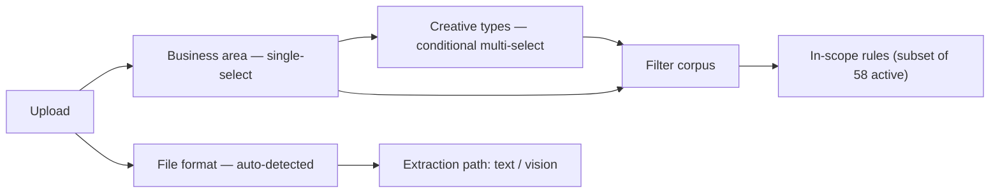

# Marketing-material segmentation

How the checker breaks a piece of marketing material into segments, and which rules
light up for each. **Generated from `corpus/rules/*.json` by `scripts/build_segments.py`** —
regenerate after any corpus change. Scope logic is imported from `src/corpus.py`.

A creative is classified on three axes. Two of them filter the rule corpus; the third
only chooses the extraction path.

**Filter rule:** a rule is in scope when its `applies_to` contains `all` or the selected
area, **and** its `creative_type` contains `all` or intersects the selected types (an
empty selection — IAP — matches only `all`-tagged rules). Conditional rules then fire only
if their trigger feature is present in the content. The `all` tags are the mandatory
baseline and are never user-facing options.

**Warn-only scheme net:** if a non-Scheme-related run detects a scheme name or
performance figures, the verdict carries a selection warning (scheme rules stayed off).

## Axis 1 — Business area (`applies_to`, single-select)

| Segment | Meaning | Rules (incl. `all` baseline) |
|---|---|---|
| `scheme_related` | Creatives about a mutual-fund scheme (incl. NFOs and yield/debt creatives). | 54 |
| `iap` | Investor awareness / education initiatives. Takes no creative-type input. | 20 |
| `others_media` | Brand, media and long-form material: social posts, articles, blogs, anniversaries. | 22 |
| `all` *(baseline)* | Mandatory rules that run for every area. | 19 |

## Axis 2 — Creative type (`creative_type`, conditional multi-select)

| Area | Creative types offered |
|---|---|
| `scheme_related` | `nfo`, `key_visual`, `yield` |
| `iap` | *(none — IAP takes no creative-type input)* |
| `others_media` | `social_post`, `article`, `blog`, `anniversary` |

`video` is encoded on rules but inactive in v1 (no video option is offered).

## Axis 3 — File format (auto-detected)

| Format | Handling |
|---|---|
| DOCX | Text extracted directly. Build-first format. |
| PDF (text layer) | Text extracted directly. |
| PDF (scanned / image) | No text layer — vision pipeline. |
| Image / banner | Vision pipeline (layout, legibility, prominent-person). |
| Carousel | Multi-image — each frame through the image pipeline, grouped per frame. |

## Coverage — rules in scope per user-selectable segment

Each row is one selectable segment. **Total in scope** with **always-on (unconditional)**
in parentheses; the remainder are conditional and fire only when their feature is detected.
Multi-selecting creative types unions their rule sets.

| Business area | Creative type | Rules in scope |
|---|---|---|
| Scheme-related | NFO | 54 (17 always-on) |
| Scheme-related | Key visual | 53 (16 always-on) |
| Scheme-related | Yield / debt | 53 (16 always-on) |
| IAP | *(none)* | 20 (12 always-on) |
| Others & Media | Social media post | 20 (12 always-on) |
| Others & Media | Article | 20 (12 always-on) |
| Others & Media | Blog | 20 (12 always-on) |
| Others & Media | Anniversary | 20 (12 always-on) |

> IAP and Others & Media segments are lean because only the mandatory `all` baseline plus
> their own segment rules apply; scheme-specific rules stay off there (warn-only net).
