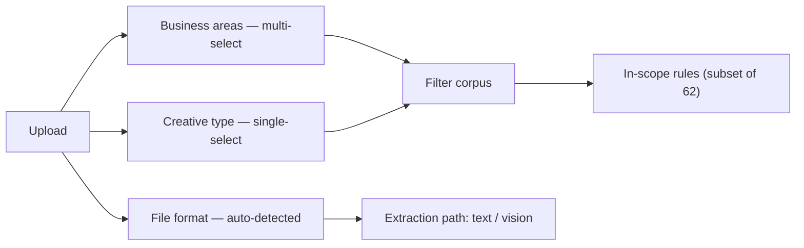

# Marketing-material segmentation

How the checker breaks a piece of marketing material into segments, and which rules
light up for each. **Generated from `corpus/rules/*.json` by `scripts/build_segments.py`** —
regenerate after any corpus change.

A creative is classified on three axes. Two of them filter the rule corpus; the third
only chooses the extraction path.

**Filter rule:** a rule is in scope when its `creative_type` includes the selected type
**and** its `applies_to` contains `all` or one of the selected areas. Conditional rules
then fire only if their trigger feature is present in the content.

## Axis 1 — Business area (`applies_to`)

*What the material is about.* Multi-select; tags are additive, so an NFO creative is
reviewed as **mf_scheme + nfo** (select every area that applies).

| Segment | Meaning | Status | Rules |
|---|---|---|---|
| `all` | Applies to every business area (the unconditional baseline). | implicit | 20 |
| `mf_scheme` | Mutual-fund scheme advertisements. | v1 | 60 |
| `nfo` | New Fund Offer creatives — additive to mf_scheme (an NFO is an MF scheme). | v1 | 21 |
| `iap` | Investor awareness / education initiatives. | v1 | 21 |
| `non_iap` | Non-IAP material. | future | 0 |
| `aif` | Alternative Investment Fund material. | future | 0 |
| `pms` | Portfolio Management Service material. | future | 0 |
| `branding` | Brand / corporate creatives. | future | 0 |
| `social_media` | Social-handle / branding material. | future | 0 |

*(`all`/`mf_scheme`/`nfo`/`iap` counts include the `all`-tagged baseline that applies
to every area; `future` areas show only rules explicitly tagged to them — currently 0.)*

## Axis 2 — Creative type (`creative_type`)

*What kind of creative it is.* Single-select.

| Segment | Meaning | Status | Rules |
|---|---|---|---|
| `general_kv` | A general 'key visual' creative. | v1 | 55 |
| `anniversary` | A scheme / fund anniversary post. | v1 | 56 |
| `yield` | A creative showing yield / YTM. | v1 | 55 |
| `article_blog` | A long-form article or blog. | v1 | 57 |
| `social_post` | A social-media post. | v1 | 56 |
| `video` | A video creative. | encoded, inactive in v1 | 59 |

## Axis 3 — File format (auto-detected)

*How it was supplied.* Chooses the extraction path, **not** which rules apply.

| Format | Handling |
|---|---|
| DOCX | Text extracted directly. Build-first format. |
| PDF (text layer) | Text extracted directly. |
| PDF (scanned / image) | No text layer — vision pipeline. |
| Image / banner | Vision pipeline (layout, legibility, prominent-person). |
| Carousel | Multi-image — each frame through the image pipeline, grouped per frame. |

## Coverage matrix — rules in scope per segment

Rows = creative type, columns = a realistic area selection. Each cell is
**total in scope** with **always-on (unconditional)** in parentheses; the remainder are
conditional and fire only when their feature is detected.

| Creative type | MF scheme | NFO (+scheme) | IAP |
|---|---|---|---|
| general kv | 53 (16) | 54 (17) | 18 (12) |
| anniversary | 54 (17) | 55 (18) | 18 (12) |
| yield | 53 (16) | 54 (17) | 18 (12) |
| article blog | 55 (18) | 56 (19) | 18 (12) |
| social post | 54 (17) | 55 (18) | 18 (12) |
| video *(inactive)* | 57 (19) | 58 (20) | 21 (14) |

> Video is encoded but inactive in v1 — its column counts are what *would* apply once
> video is switched on. IAP is sparse because only its own disclaimer (DISC-027) plus
> the `all`-baseline rules apply to a pure investor-awareness creative.
